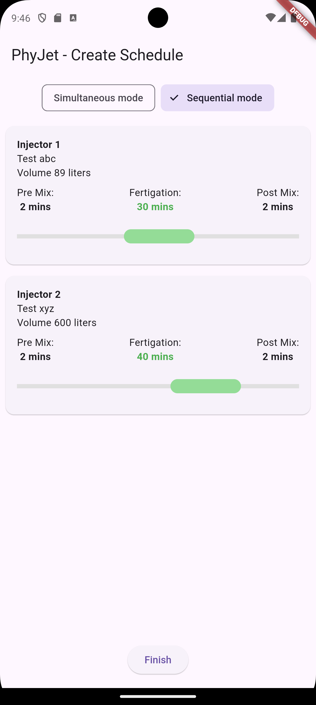
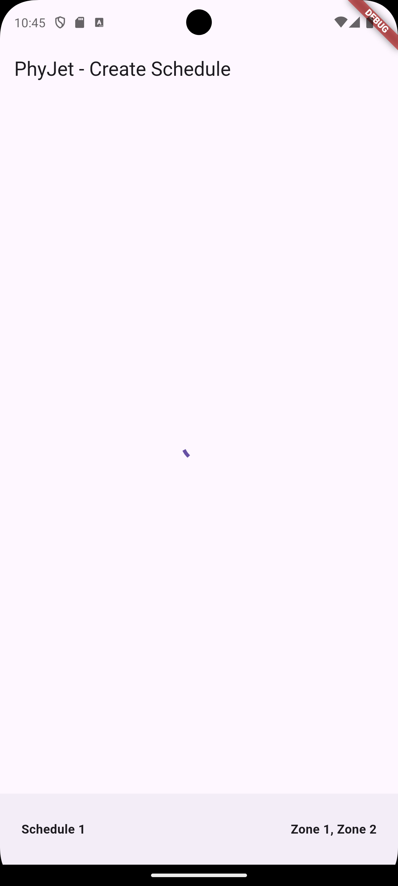
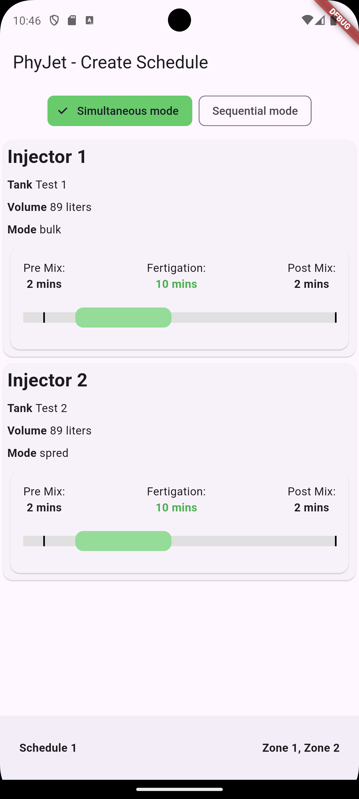
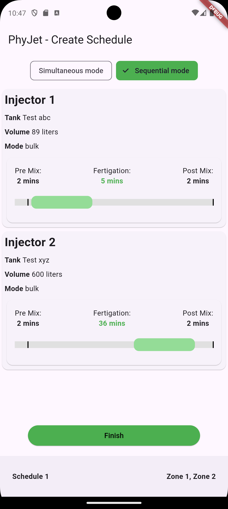
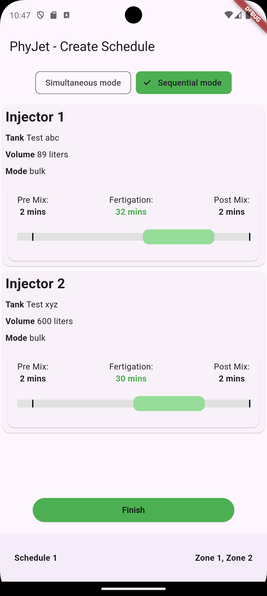
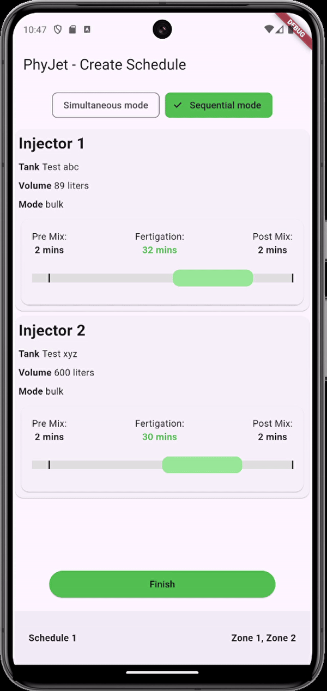

# Fertigation Controller Application

This Flutter application provides a UI to manage and control fertigation injectors in two different modes: **Simultaneous Mode** and **Sequential Mode**. The application fetches data from a Mock API to populate injector cards and allows users to adjust fertigation settings.

## Features

### 1. Tabs
- **Simultaneous Mode**: All injectors run simultaneously. The Fertigation Bar is non-draggable and remains static.
- **Sequential Mode**: Injectors run one after another in a sequence. The Fertigation Bar becomes draggable, allowing users to adjust the fertigation time.

### 2. Injector Cards
Each injector has its own card displaying:
- Tank and volume details.
- Fixed Pre-Mix and Post-Mix values.
- A Fertigation Bar to adjust fertigation time.

### 3. API Integration
- The application uses a Mock GET API to fetch data for the injector cards.
- The data includes mode, Pre-Mix, Fertigation, and Post-Mix values.
- The mode fetched from the API determines the UI behavior.

### 4. UI Logic
- **Mode Toggle**: A toggle switch at the top of the screen to switch between Simultaneous Mode and Sequential Mode.
- **Injector Sequence Number**: In Sequential Mode, each injector displays a sequence number.
- **Finish Button**: In Sequential Mode, a "Finish" button is displayed at the bottom of the screen to complete the sequence.

### 5. Code Quality
- Follows best practices in Flutter for state management, API integration, and UI design.
- Clean, readable, and well-documented code.
- Handles errors gracefully, such as API failures.

## Screenshots


<div style="display: flex; overflow-x: auto; white-space: nowrap;">

  <div style="margin-right: 10px;">
    <h4>Simultaneous Mode</h4>
    
  </div>

  <div style="margin-right: 10px;">
    <h4>Sequential Mode</h4>
    
  </div>

  <div style="margin-right: 10px;">
    <h4>Injector Cards</h4>
    
  </div>

  <div style="margin-right: 10px;">
    <h4>Sequential Mode</h4>
    
  </div>

  <div style="margin-right: 10px;">
    <h4>Injector Cards</h4>
    
  </div>

</div>


## Screen Recording




## Getting Started

### Prerequisites
- Flutter SDK
- Dart

### Installation
1. Clone the repository:
   ```bash
   git clone https://github.com/Pranav-stac/Fertigation

2.Navigate to the project directory:

3.Install the dependencies:
flutter pub get

4. Run using a emulator or chrome debug
